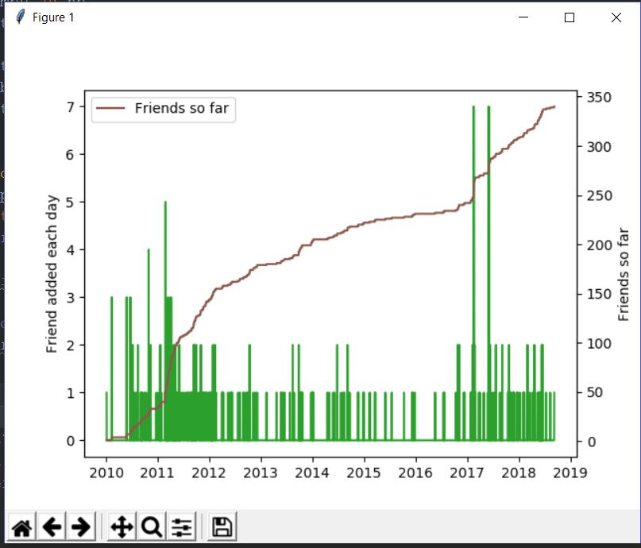
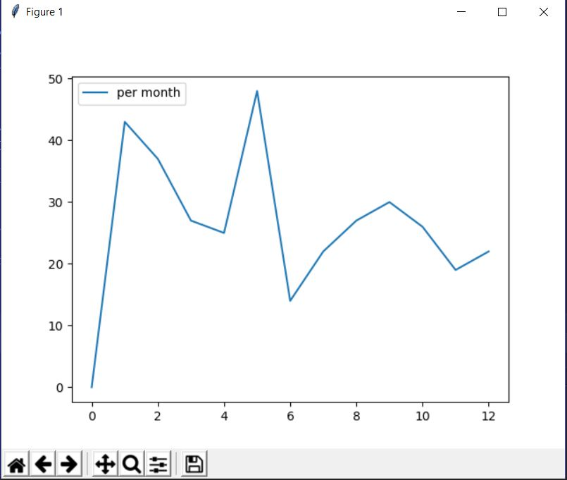

Facebook users can download their facebook data
Settings - > Your facebook Information -> Download Your Information 
Depending upon the duration the users can download their respective data
The facebook data is available in JSON and HTML format

The data analyzed here is in JSON format

change the path accordingly in the various functions

1)friends_added.py
In this file number of friends added each day and each month from the creation of the facebook account has been shown

